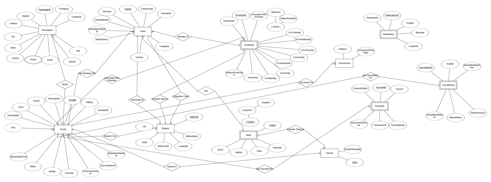

# Railway Management System 🚂

A comprehensive system for managing railway operations including ticket booking, seat allocation, payment processing, and schedule management. Built with MySQL for database operations and Python for the dashboard interface.

 <!-- Add your ER diagram image here when available -->

## Features ✨
- Passenger & Train Management
- Ticket Booking with PNR Generation
- Automated Fare Calculation with Concessions
- Seat Allocation (Confirmed/RAC/WL)
- Payment Processing & Reconciliation
- Schedule Management
- Cancellation & Refund System
- Real-time Notifications
- Occupancy Reports
- Automatic Waitlist Promotion

## Prerequisites 📋
- MySQL Server 8.0+
- Python 3.8+
- MySQL Workbench (Recommended)
- Python Packages: `mysql-connector-python`, `tkinter`, `matplotlib`

## Installation 🛠️
### 1. Download MySQL Workbench
Click here to download: https://dev.mysql.com/downloads/workbench/

### 2. Database Setup
1. **Create MySQL Database**:
   ```sql
   CREATE DATABASE railway;
   USE railway;
   ```

2. **Import Schema (Using MySQL Workbench)**:
   * Open MySQL Workbench
   * Connect to your local instance
   * File → Run SQL Script → Select provided SQL file
   * Execute all statements

3. **Verify Tables**:
   ```sql
   SHOW TABLES;
   ```

### 3. Python Environment Setup
1. **Install Requirements**:
   ```
   pip install mysql-connector-python matplotlib tk
   ```

2. **Create Configuration File (db_config.ini)**:
   ```
   [DATABASE]
   host = localhost
   port = your mysql workbench port number
   user = root
   password = your_mysql_password
   database = railway
   ```

### 4. Running the Dashboard 🖥️
**Start Application**:
```
python main.py
```

**Dashboard Features:**
* Passengers Management
* Train Schedules
* Ticket Booking Interface
* Payment Reconciliation
* Real-time Reports
* Seat Availability Charts

## Database Schema Overview 🗄️
### Core Tables
| Table | Description |
|-------|-------------|
| Passengers | Passenger personal details |
| Trains | Train metadata and routes |
| Schedules | Detailed station schedules |
| Seats | Seat inventory management |
| Tickets | Booking records |
| Payments | Transaction history |

### Relationships
* Trains ↔ Schedules (1:M)
* Trains ↔ Seats (1:M)
* Passengers ↔ Tickets (1:M)
* Tickets ↔ Payments (1:1)

## Important Notes 📝
### Concession Rules:
* Senior Citizens (60+): 40% off
* Students (18-25): 25% off
* Disability: 50% off

### PNR Generation Logic:
```python
PNR = First2Letters(Source) + First2Letters(Dest) + DDMM + Random2Digits
```